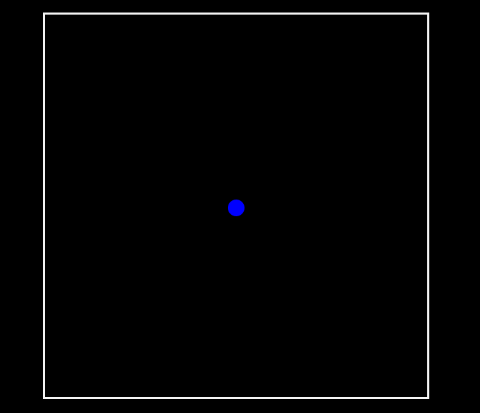

# Example of bouncing mechanics

## Things to note:

- *Semantic HTML elements arent really useful here so arent used.*
- *This is a just a simple example*
- *Everything (JS and CSS) is vanilla*
- *No frameworks so no additional setup required*

## What am I building?

- **Basically, we will be starting with a circle in the center which will bounce infintely from one side to the other** 

